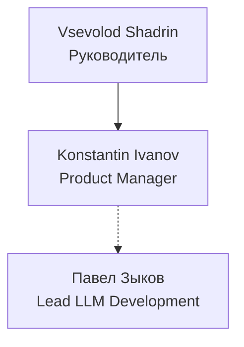

# Карта связей

```mermaid
graph TD
    shadrinv["Vsevolod Shadrin<br/>Руководитель"] --> kivanov["Konstantin Ivanov<br/>Product Manager"]
    kivanov -.-> zykovp["Павел Зыков<br/>Lead LLM Development"]
```

> Сгенерируй Mermaid-диаграмму на основе данных интервью: руководитель → владелец → подчинённые. Контакты добавь как отдельные связи (пунктирные линии).
