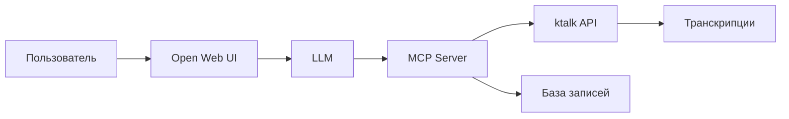

# MCP к Talk - Мастер класс (25.02.2026)

**Дата:** 25 февраля 2026
**Участники:** [[zykovp]], [[kivanov]]
**Длительность:** ~23 минуты
**Тип:** Мастер-класс по MCP интеграции

---

## Архитектура MCP ktalk

### MCP Server ([[zykovp]])

- База: **FastMCP** (Python)
- Транспорт: **HTTP/SSE**
- Аутентификация: JWT токен Нау

### Инструменты (Tools)

| Инструмент | Описание |
|------------|----------|
| `get_user_records` | Получить список записей пользователя (с пагинацией и фильтром по дате) |
| `get_recording_transcript` | Получить транскрипт конкретной записи |

---

## Pipeline работы

1. **Scheduler** (фон) → опрашивает ktalk API о новых записях
2. **База данных** → сохраняет ID записей и участников
3. **Пользователь** → запрашивает "что было на встрече вчера?"
4. **LLM** → вызывает `get_user_records`
5. **MCP Server** → проверяет JWT, получает email
6. **База** → возвращает записи этого пользователя
7. **LLM** → вызывает `get_recording_transcript`
8. **ktalk API** → возвращает полный транскрипт

---

## Ключевые технические решения

| Решение | Описание |
|---------|----------|
| **Промежуточный сервер** | Необходим из-за ограничений ktalk API (только admin key) |
| **JWT валидация** | MCP Server дёргает Нау API для подтверждения пользователя |
| **Фильтрация по участникам** | В базе хранится info об участниках, фильтрация на стороне MCP |
| **FastMCP** | Декораторы для регистрации tools |

---

## Обсуждаемые вопросы

### MCP протокол

- **3 компонента**: MCP клиент, MCP сервер, LLM
- **Function calling** → стандартизация через MCP
- OpenAI: свой формат, Anthropic: → создали MCP

### Контур ↔ Нау интеграция

- Поле "Должность" в Контуре → для сопоставления данных
- JWT токен → passes через MCP Server

---

## Решения

| # | Решение | Ответственный |
|---|---------|---------------|
| 1 | Сделать **Skill** для работы с MCP ktalk (не ассистента) | [[zykovp]] |
| 2 | Подключить Claude Code к MCP Server | [[zykovp]] |
| 3 | Подготовить pilot проекта | [[kivanov]] |

---

## Заметки

> [[zykovp]] сделал MCP Server полностью через терминал, не открывая IDE. Проект называется `ktalk-mcp`.
>
> **Ключевой инсайт**: MCP меняет уровень абстракции — вместо SQL запросов просто "количество звонков за день".

---

## Следующие шаги

- [ ] [[zykovp]] подключит Claude Code к MCP
- [ ] Создать Skill с документацией по MCP ktalk
- [ ] Подготовить pilot для команды

---

## История изменений

| Дата | Изменение |
|------|-----------|
| 26.02.2026 | Запись мастер-класса создана на основе ktalk транскрипта |
